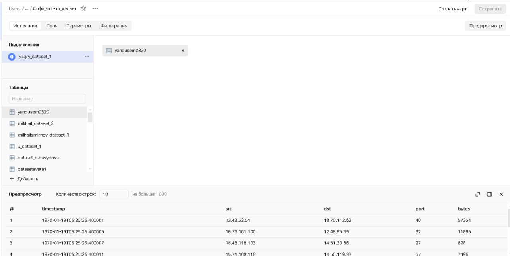
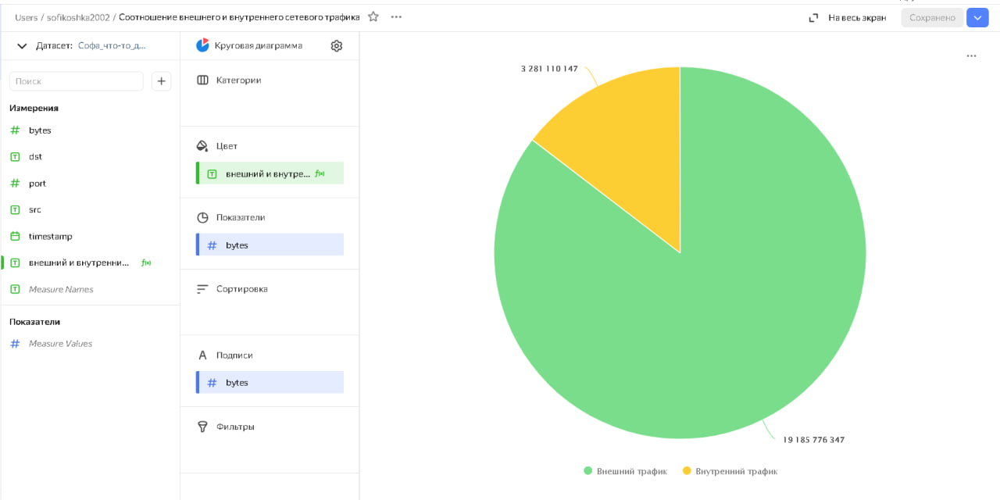
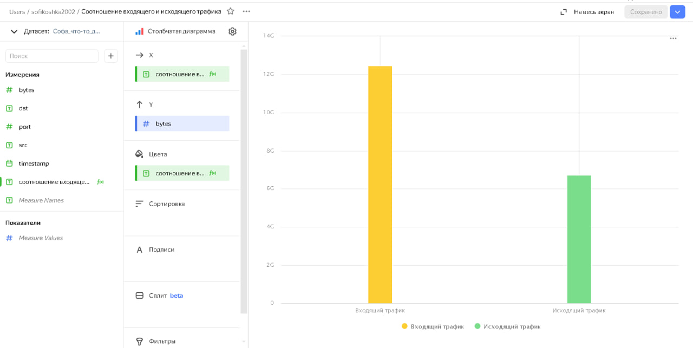
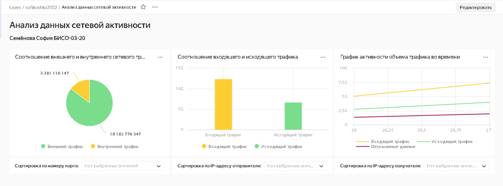

# Практическая работа №2


[Ссылка на
дашборд](https://github.com/Sofikoshka7/search_for_threats.git)

## Цель работы

1.  Изучить возможности технологии Yandex DataLens для визуального
    анализа структурированных наборов данных
2.  Получить навыки визуализации данных для последующего анализа с
    помощью сервисов Yandex Cloud
3.  Получить навыки создания решений мониторинга/SIEM на базе облачных
    продуктов и открытых программных решений
4.  Закрепить практические навыки использования SQL для анализа данных
    сетевой активности в сегментированной корпоративной сети

## Исходные данные

1.  ОС Windows
2.  Технология Yandex DataLens
3.  Сервис Yandex Cloud
4.  RStudio

## План

1.  Используя сервис Yandex DataLens настроить доступ к результатам
    Yandex Query
2.  Представить в виде круговой диаграммы соотношение внешнего и
    внутреннего сетевого трафика
3.  Представить в виде столбчатой диаграммы соотношение входящего и
    исходящего трафика из внутреннего сетвого сегмента.
4.  Построить график активности (линейная диаграмма) объема трафика во
    времени.
5.  Все построенные графики вывести в виде единого дашборда в Yandex
    DataLens

## Описание шагов:

### 1. Используя сервис Yandex DataLens настроить доступ к результатам Yandex Query


### 2. Создаем из запроса YandexQuery датасет DataLens



### 3. Создаём чарты по заданию


### *1) Представить в виде круговой диаграммы соотношение внешнего и внутреннего сетевого трафика.*



### *2) Представить в виде столбчатой диаграммы соотношение входящего и исходящего трафика из внутреннего сетвого сегмента.*



### *3) Построить график активности (линейная диаграмма) объема трафика во времени.*


### 4. Составляем дашборд



## Оценка результатов

Задача выполнена при помощи облачных сервисов Yandex Cloud и технологии
Yandex DataLens, удалось познакомится с их функционалом и особенностями.

## Вывод

В данной работе я смог закрепить практические навыки использования SQL
для анализа данных сетевой активности в сегментированной корпоративной
сети и получил навыки визуализации данных для последующего анализа с
помощью сервисов Yandex Cloud

``` r
sprintf("Мы всё сделали, мы молодцы!")
```

    [1] "Мы всё сделали, мы молодцы!"
