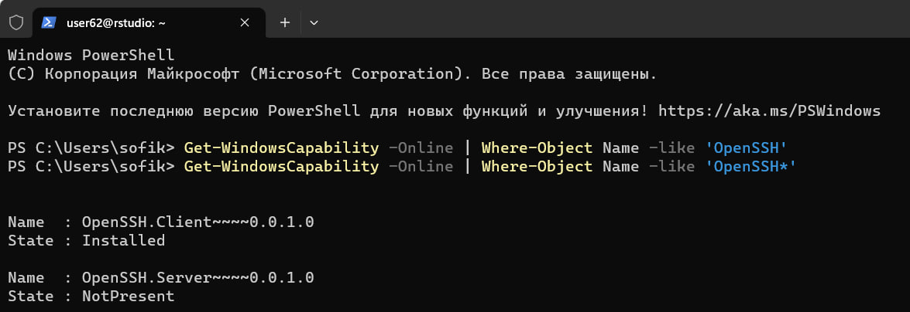
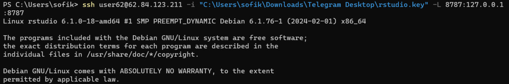
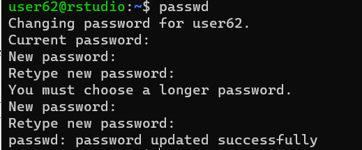

# lab3

# Анализ данных сетевого трафика при помощи библиотеки Arrow

## Цель работы

1.  Изучить возможности технологии Apache Arrow для обработки и анализ больших данных
2.  Получить навыки применения Arrow совместно с языком программирования R
3.  Получить навыки анализа метаинфомации о сетевом трафике
4.  Получить навыки применения облачных технологий хранения, подготовки и анализа данных: Yandex Object Storage, Rstudio Server.

## Исходные данные

1.  ОС Windows
2.  Apache Arrow
3.  RStudio
4.  Yandex Object Storage

## План

1.  Выполним вход по ssh в RSTUDIO под нашим user
2.  Выполним практическое задание
3.  Составим отчет

## Ход работы

1.  Подключаемся к облачному серверу RStudio Server с помощбю ssh под нашим user62, связываем существующий репозиторий на GitHub со студией







1.  Выполняем практические задания

``` r
library(arrow, warn.conflicts = FALSE)
```

```         
Some features are not enabled in this build of Arrow. Run `arrow_info()` for more information.
```

``` r
library(tidyverse, warn.conflicts = FALSE)
```

```         
── Attaching core tidyverse packages ──────────────────────── tidyverse 2.0.0 ──
✔ dplyr     1.1.4     ✔ readr     2.1.5
✔ forcats   1.0.0     ✔ stringr   1.5.1
✔ ggplot2   3.4.4     ✔ tibble    3.2.1
✔ lubridate 1.9.3     ✔ tidyr     1.3.1
✔ purrr     1.0.2     

── Conflicts ────────────────────────────────────────── tidyverse_conflicts() ──
✖ lubridate::duration() masks arrow::duration()
✖ dplyr::filter()       masks stats::filter()
✖ dplyr::lag()          masks stats::lag()
ℹ Use the conflicted package (<http://conflicted.r-lib.org/>) to force all conflicts to become errors
```

## Задание 1: Надите утечку данных из Вашей сети

Важнейшие документы с результатами нашей исследовательской деятельности в области создания вакцин скачиваются в виде больших заархивированных дампов. Один из хостов в нашей сети используется для пересылки этой информации – он пересылает гораздо больше информации на внешние ресурсы в Интернете, чем остальные компьютеры нашей сети. Определите его IP-адрес.

## Задание 2: Надите утечку данных 2

Другой атакующий установил автоматическую задачу в системном планировщике cron для экспорта содержимого внутренней wiki системы. Эта система генерирует большое количество трафика в нерабочие часы, больше чем остальные хосты. Определите IP этой системы. Известно, что ее IP адрес отличается от нарушителя из предыдущей задачи.

## Задание 3: Надите утечку данных 3

Еще один нарушитель собирает содержимое электронной почты и отправляет в Интернет используя порт, который обычно используется для другого типа трафика. Атакующий пересылает большое количество информации используя этот порт, которое нехарактерно для других хостов, использующих этот номер порта. Определите IP этой системы. Известно, что ее IP адрес отличается от нарушителей из предыдущих задач.

## Оценка результатов

Задача выполнена при помощи облачных технологий, приложения RStudio и Apache Arrow, удалось познакомится с функционалом Arrow и при его помощи удалось выполнить задание.

## Вывод

В данной работе я смог познакомиться с применением облачных технологий хранения, подготовки и анализа данных. Удалось проанализировать метаинформацию о сетевом трафике.
